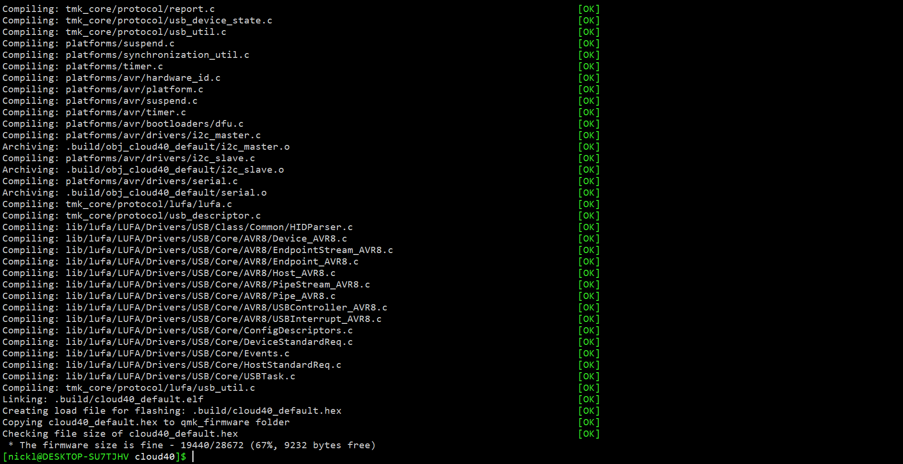

# Cloud40 - Designed by Brandon Zhang

## Overview
Hi! I’m Brandon, and welcome to my cloud40 build log. This space is dedicated to showcasing the steps I went through to design the cloud40, as well as any thoughts or insights I want to provide to explain the process.

## Initial Concept

The cloud40 is a split keyboard that allows the user to position each half wherever they want. The keys are arranged in a grid-like fashion, and the columns are then staggered to match the natural contours of the hand. There are only three rows for each finger to minimize stretching and unnecessary movement. Full functionality is achieved through one of the four thumb keys on the bottom, which toggles between letter, number, and function layers, similar to a phone keyboard. The main goal of this keyboard is to provide a more natural typing experience than traditional layouts.

Each half is controlled by an Arduino Pro Micro microcontroller, which detects the keypresses and sends the information to the computer. The two microcontrollers are connected through a TRRS audio cable, since a USB connection poses a risk of the computer mistaking it for a normal connection and shorting out the device.

## 3D Modeling

The parts for one half of the keyboard were modeled in Fusion 360. I then mirrored the model in my 3D printer’s slicer for the other half.

## Prototyping

I was already familiar with the dimensions of a mechanical keyboard, so initially test-fitting the switches and keycaps went smoothly. In earlier prints the hanging edges inside the main case were unstable, so I needed to tweak the support settings in the slicer. I also moved the alignment pins on the bottom plate closer together to compensate for the looser tolerance with the top case.

## Wiring Matrix

Each key switch has two metal pins on the bottom, which are used to wire them up to a circuit board. However, since this keyboard is wired by hand, each pin needs to have a way to communicate with the central microcontroller. Since the Pro Micro doesn’t have enough pins to accommodate all 20 keys individually, each row and each column (shown above in blue and red, respectively) is assigned to a pin. That way, when a key is pressed, the microcontroller knows which row and which column the key is in and can output the correct character. Each row pin has a diode attached to it (shown in green), only allowing the current to flow in one direction. This ensures the microcontroller can correctly detect the input from each individual key if multiple keys are pressed simultaneously.

## Assembly

Shown above is the fully soldered assembly. For the sake of convenience, I also wired up two reset buttons to each Pro Micro, so I wouldn’t have to use tweezers to touch the pins when I flash the firmware.

The switches I used for this keyboard were the Gateron Clears, which have a pleasantly light operating force of 35g. This should further minimize any pain or discomfort when typing on this keyboard.

## Firmware

The firmware for this keyboard was built using QMK, which converts my code into a .hex file that I can flash onto the Pro Micros.

Here is where I create the keymap of the keyboard. Shown above is the base layer, which is the standard qwerty layout along with a few essential modifiers.

Compiling the firmware.

Flashing the firmware using the QMK toolbox app.

Success!

## The Final Keyboard

Here’s the finished keyboard. I chose a set of keycaps that have a uniform height, allowing for easy interchange if the user wants to switch keymaps.
